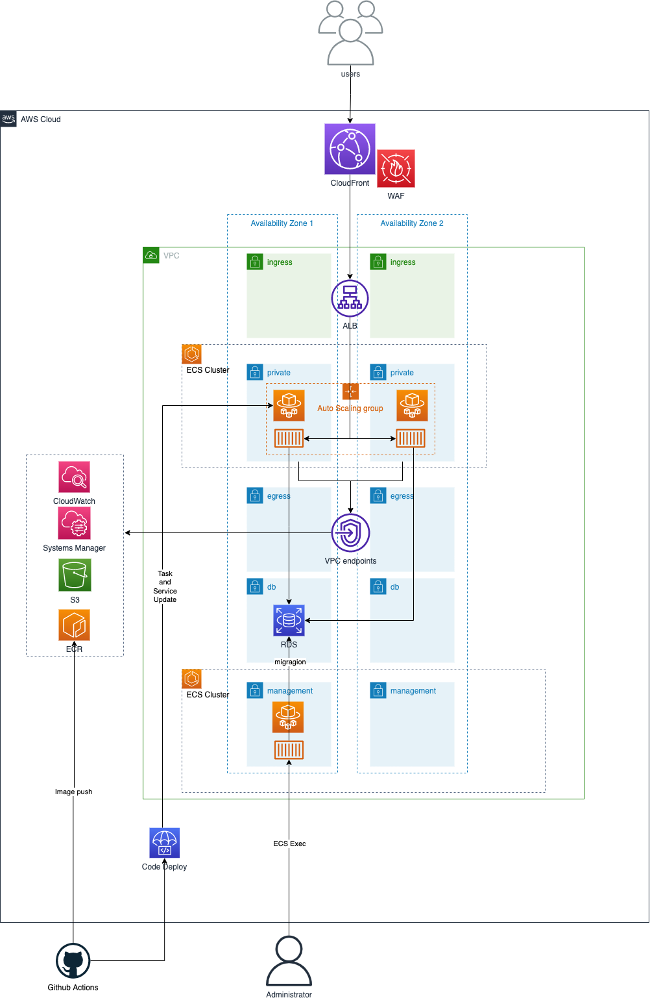

# Overview

This repository is for my own learning purpose.It includes todo application with golang, AWS infrastructure with terraform, and CICD with Github actions.

# Architecture



# Usage

## Domain and Certificates

The infrastructure needs domain and certificates.You can create it with Route53 and AWS Certificate Manager.HTTPS communication is needed between viewer, CloudFront and ALB.So you need global region certificate for CloudFront, and local region certificate for ALB.

## ECR

Create ECR repository for your application image and management image.

## Github CICD

First, set Github Actions Secrets.Second, push commit and trigger workflow.Then the images of application and management server will be pushed to the ECR repository.

- AWS_ROLE_ARN
- ECR_REGISTRY
- ECR_REPOSITORY
- ECR_MANAGEMENT_REPOSITORY
- SLACK_CHANNEL
- SLACK_WEBHOOK

## AWS terraform

First, Set terraform `infrastructure/terraform/terraform.tfvars` file.Then start `terraform apply`.

```:terraform_sample.tfvars
region                  = "your_AWS_region"
app_name                = "todo-app"
local_certificate_arn   = "arn:aws:acm:{AWS_REGION}:{AWS_ACCOUNT_ID}:certificate/hoge"
global_certificate_arn  = "arn:aws:acm:us-east-1:{AWS_ACCOUNT_ID}:certificate/huga"
host_zone_name          = "your_domain_name"
sub_domain_name         = "todo-app.{your_domain_name}"
alb_access_header_name  = "access-restriction-your-custom-header"
alb_access_header_value = "random_string"
image_arn               = "{AWS_ACCOUNT_ID}.dkr.ecr.{AWS_REGION}.amazonaws.com/app/todo_app_server:{IMAGE_TAG}"
management_image_arn    = "{AWS_ACCOUNT_ID}.dkr.ecr.{AWS_REGION}.amazonaws.com/app/todo_app_management_server:{IMAGE_TAG}"
time_zone               = "Asia/Tokyo"
db_username             = "set_your_db_username"
db_password             = "set_your_db_password"
db_name                 = "todo"
```

## Migration

Check your ECS management task ID and start ECS Exec with command `aws ecs execute-command --cluster todo-app-ecs-management-cluster --task {your_task_ID} --container management --interactive --command "sh"`.Next, repeat to execute `make migrate_up` for numbers of migration files.Then, you can access to your app via subdomain.

## Application update

Push the commit of application change, CICD workflow build new image and push it to ECR, and update ECS task and service.You don't need to execute `terraform apply`.
